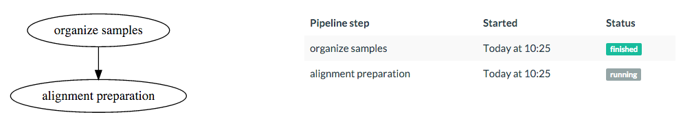
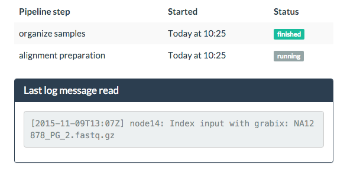
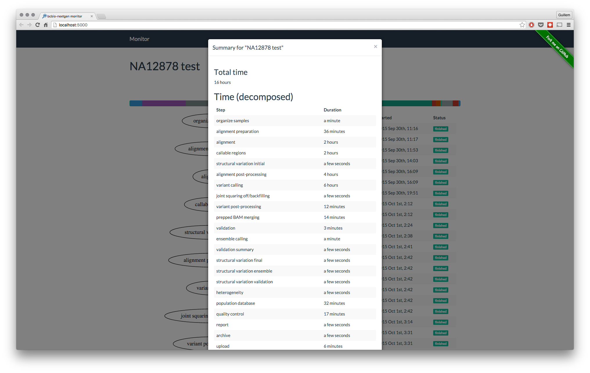

<p align="center">
  <a href="https://github.com/guillermo-carrasco/bcbio-nextgen-monitor">
    
  </a>
</p>


### What is this?
[bcbio-nextgen][bcbio] is a python toolkit providing best-practice pipelines for fully automated high throughput sequencing analysis.

**bcbio-monitor** is an independent web application to track `bcbcio-nextgen` analyses.

Going to the point, you only tell `bcbio-monitor` where [bcbio-nextgen-debug.log][bcbio-logging] is (either in your local machine or on a remote server), and it'll do the work.

**For a technical overview of bcbio-monitor**, please read [this][tech-post] blog post.

### Features

#### Steps flowchart and table
For a quick overview of the analysis status, just look at the flowchart or the information table.



_NOTE: On future versions, the flowchart will be more useful, showing information about the nodes
in which the steps were ran._

#### Time used per step


This bar will show you the percentage of time used for every step. Hover over the portions
to see the percentage.

#### Analysis feedback
Since there can be several hours between steps, to add some feedback, I added a panel to show
the last message read.



#### Final summary
When the analysis is finished, an option will appear to show a global summary.



As of by now, it is very basic. Will show more information in future versions.

### Installation

Install via `pip install bcbio-monitor` for the latest stable release.

Get the latest development version by cloning this repository and installing it:

    git clone https://github.com/guillermo-carrasco/bcbio-nextgen-monitor.git
    cd bcbio-nextgen-monitor
    pip install -e .

### Usage

Run `bcbio_monitor -h` to get information about usage. Please don't hesitate to [open an issue][issue] if something is not clear.

```
$~> bcbio_monitor -h
usage: bcbio_monitor [-h] [--config CONFIG] [--title TITLE] [--no-update]
                     [--no-browser] [--local]
                     logfile

Show bcbio-nextgen analysis status on a web browser

positional arguments:
  logfile          Path to the file bcbio-nextgen-debug.log

optional arguments:
  -h, --help       show this help message and exit
  --config CONFIG  PAth to the configuration file, defaults to
                   ~/.bcbio/monitor.yaml
  --title TITLE    Title (or name) for the analysis, i.e NA12878 test
  --no-update      Don't update frontend with the last log line read (less
                   requests)
  --no-browser     Don't open a new browser tab
  --local          Force the monitor to look for the log file locally
                   (regardless of the configuration file.)
```

#### Configuration
bcbio-monitor expects a configuration file in [yaml][yaml] format to be located in `~/.bcbio/monitor.yaml`. There are two main sections that you may want to consider, those are
`flask` and `remote`.

* In `flask` section, you set [configuration parameters][flask_config] for the Flask app that runs the server.
* In `remote` server, you specify connection parameters for the machine where the logfile to read is located. **Note** that if this section is missing, bcbio-monitor will try to read the
logfile locally (which can also be useful for finished analysis).

A working example of configuration file would be like this:

```yaml
flask:
    SERVER_NAME: localhost:5000 # This is the address where bcbio_monitor will be served
    DEBUG: False

remote:
    host: <remote hostname>
    port: <SSH port> # Optional
    username: <remote username>
    password: <remote user password> # Optional
```

You can also modify the logging level by adding the corresponding section in the same configuration file:

```yaml
log:
    level: INFO # or WARN, ERROR, DEBUG
```

Logging level is `INFO` by default.

#### Example of usage

    cd tests
    bcbio_monitor data/bcbio-nextgen-debug.log --title "Test bcbio-monitor"

[bcbio]: https://bcbio-nextgen.readthedocs.org/en/latest/
[bcbio-logging]: https://bcbio-nextgen.readthedocs.org/en/latest/contents/testing.html#logging
[tech-post]: http://mussol.org
[issue]: https://github.com/guillermo-carrasco/bcbio-nextgen-monitor/issues/new
[yaml]: http://yaml.org/
[flask_config]: http://flask.pocoo.org/docs/0.10/config/#builtin-configuration-values
