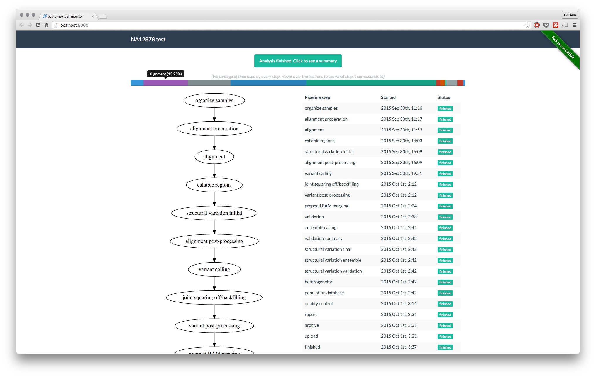

## Monitor the status of bcbio-nextgen analyses



### What is this?
[bcbio-nextgen][bcbio] is a python toolkit providing best-practice pipelines for fully automated high throughput sequencing analysis.

Despite its greatness, it is sometimes hard to know in what point of the analysis you are, and
to get a sense of the duration of every step on the analysis. Since analyses last for several hours, you really want to get that information, and as of now, the only way to get it is to ssh
into the node where you started the analysis and grep through the logs.

For these reasons I decided to build a simple frontend to display the current status of a running (or finished) analysis. This is bcbio-nextgen-monitor.

Going to the point, you only tell bcbio-monitor where [bcbio-nextgen-debug.log][bcbio-logging] is (either in your local machine or on a remote server), and it'll do the work.

**For a technical overview of bcbio-monitor**, please read [this][tech-post] blog post.

### Installation

Install via `pip install bcbio-monitor` for the latest stable release.

Get the latest development version by cloning this repository and installing it:

    git clone https://github.com/guillermo-carrasco/bcbio-nextgen-monitor.git
    cd bcbio-nextgen-monitor
    pip install -e .

### Usage

Run `bcbio_monitor -h` to get information about usage. Please don't hesitate on [opening an issue][issue] if something is not clear.

#### Configuration
bcbio-monitor expects a configuration file in [yaml][yaml] format to be located in `~/.bcbio/monitor.yaml`. There are two main sections that you may want to consider, those are
`flask` and `remote`.

* In `flask` section, you set [configuration parameters][flask_config] for the Flask app that runs the server.
* In `remote` server, you specify connection parameters for the machine where the logfile to read is located. **Note** that if this section is missing, bcbio-monitor will try to read the
logfile locally (which can also be useful for finished analysis).

A working example of configuration file would be like this:

```yaml
flask:
    SERVER_NAME: localhost:5000 # This is the address where bcbio_monitor will be served
    DEBUG: False

remote:
    host: <remote hostname>
    port: <SSH port> # Optional
    username: <remote username>
    password: <remote user password> # Optional
```

#### Example of usage

    cd tests
    bcbio_monitor data/bcbio-nextgen-debug.log --title "Test bcbio-monitor"

[bcbio]: https://bcbio-nextgen.readthedocs.org/en/latest/
[bcbio-logging]: https://bcbio-nextgen.readthedocs.org/en/latest/contents/testing.html#logging
[tech-post]: http://mussol.org
[issue]: https://github.com/guillermo-carrasco/bcbio-nextgen-monitor/issues/new
[yaml]: http://yaml.org/
[flask_config]: http://flask.pocoo.org/docs/0.10/config/#builtin-configuration-values
